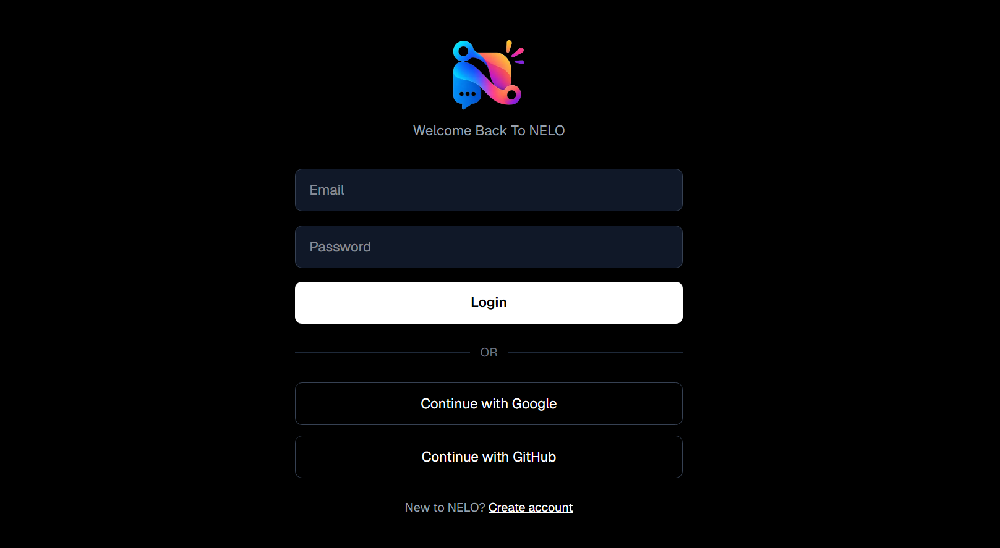
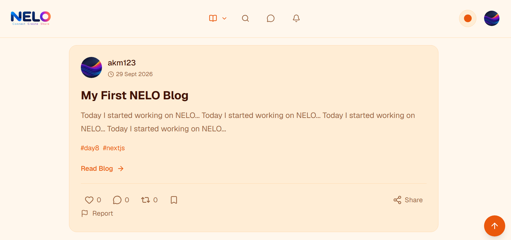
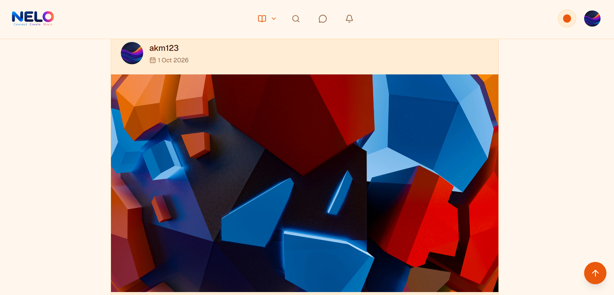
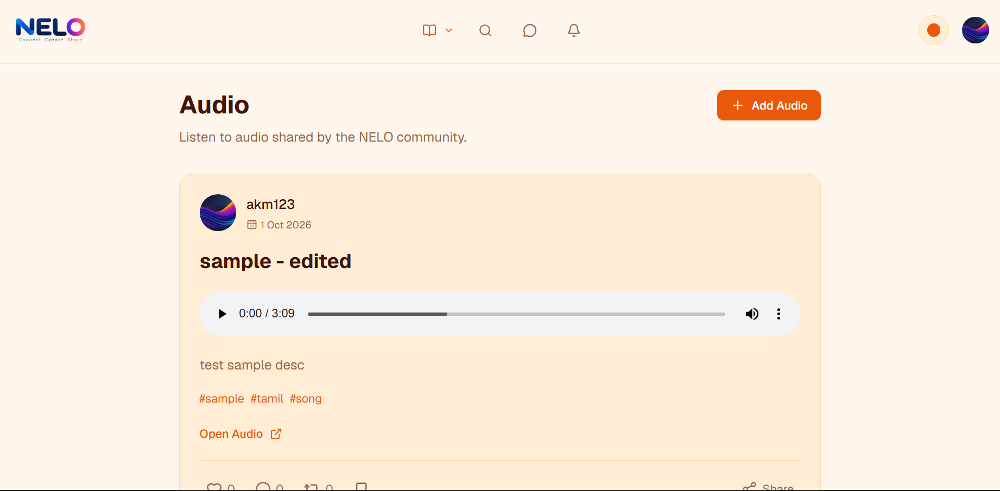
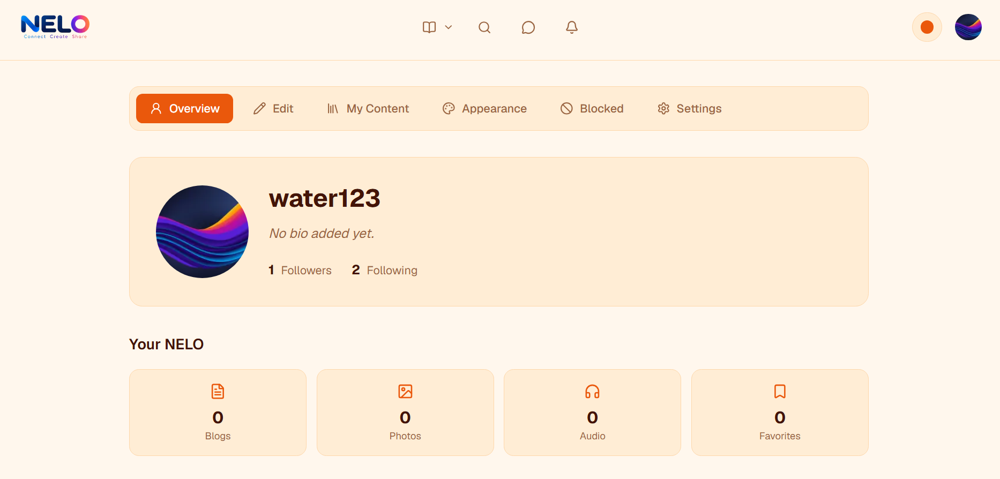
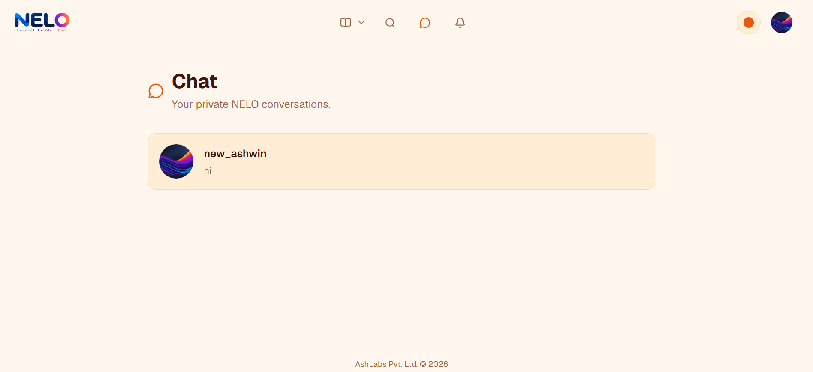
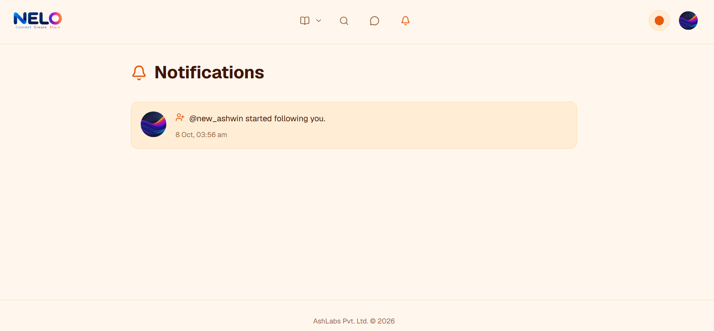
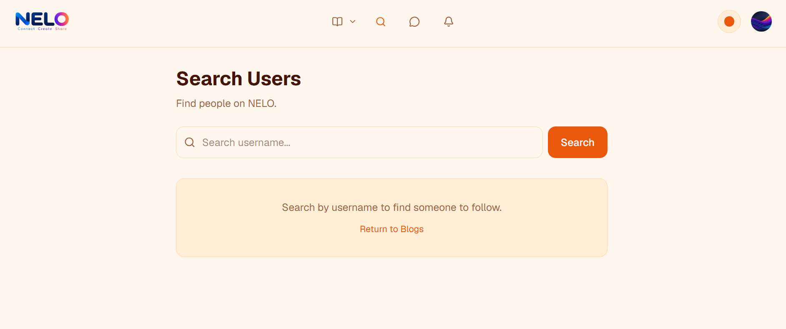

# NELO


**Connect. Create. Share.**

NELO is a full-stack social publishing and communication platform built with Next.js, React, TypeScript, Supabase and Vercel.

Users can publish blogs, photos and audio, interact with other users, follow profiles, communicate through one-to-one chat, manage their own content and receive real-time notifications.


## Status

NELO is currently in active development.

- Production deployment: Live
- CI/CD: GitHub Actions
- Hosting: Vercel
- Database/Auth/Storage/Realtime: Supabase


## Features

### Authentication

- Email/password authentication
- Google login
- GitHub login
- Profile completion flow
- Protected application routes
- Suspended-account protection

### Profiles

- Custom username
- Fixed avatar selection
- Profile bio
- Website/social links
- Follow/unfollow users
- Block/unblock users
- Followers and following pages

### Content

Users can create:

- Blogs
- Photos
- Audio posts

Content features include:

- Create
- Edit
- Delete
- Hashtags
- Individual post pages
- My Content dashboard

### Interactions

- Likes
- Comments
- Boosts
- Favorites
- Sharing

### Feeds

Separate feeds are available for:

- Blogs
- Photos
- Audio

### Chat

- One-to-one conversations
- Real-time messages
- Unread message indicators
- Blocking enforcement

### Notifications

Real-time notifications for:

- Follows
- Likes
- Comments
- Boosts
- Moderation actions

### Moderation

NELO includes a moderation system with:

- Post reporting
- Admin moderation dashboard
- Report review queue
- Moderation cases
- Anonymous moderation notifications
- 24-hour violation deadline
- Automatic post removal
- Warning tracking
- Account suspension

### Appearance

- Multiple themes
- Persistent theme selection
- Responsive desktop/mobile layout

## Screenshots

<table>
  <tr>
    <td align="center">
      
      <br /><b>Login Feed</b>
    </td>
    <td align="center">
      
      <br /><b>Blog Feed</b>
    </td>
    <td align="center">
      
      <br /><b>Photo Feed</b>
    </td>
  </tr>
  <tr>
    <td align="center">
      
      <br /><b>Audio Feed</b>
    </td>
    <td align="center">
      
      <br /><b>Profile</b>
    </td>
    <td align="center">
      
      <br /><b>Chat</b>
    </td>
  </tr>
  <tr>
    <td align="center">
      
      <br /><b>Notifications</b>
    </td>
    <td align="center">
      
      <br /><b>Search</b>
    </td>
    <td></td>
  </tr>
</table>

## Tech Stack

| Area              | Technology              |
| ----------------- | ----------------------- |
| Framework         | Next.js                 |
| UI                | React                   |
| Language          | TypeScript              |
| Styling           | Tailwind CSS            |
| Database          | PostgreSQL via Supabase |
| Authentication    | Supabase Auth           |
| Storage           | Supabase Storage        |
| Realtime          | Supabase Realtime       |
| Rich Text Editor  | TipTap                  |
| Hosting           | Vercel                  |
| Unit Testing      | Vitest                  |
| Component Testing | React Testing Library   |
| E2E Testing       | Playwright              |
| CI/CD             | GitHub Actions          |


## Architecture

```text
Browser
   |
   v
Next.js / React
   |
   +------------------+
   |                  |
   v                  v
Supabase            Vercel
   |
   +-- PostgreSQL
   +-- Authentication
   +-- Storage
   +-- Realtime
   +-- Row Level Security
```
